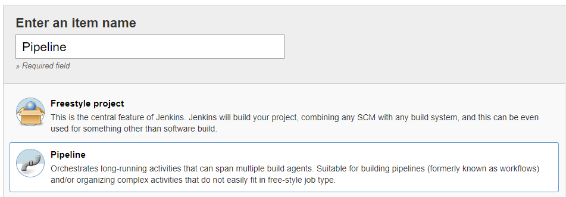
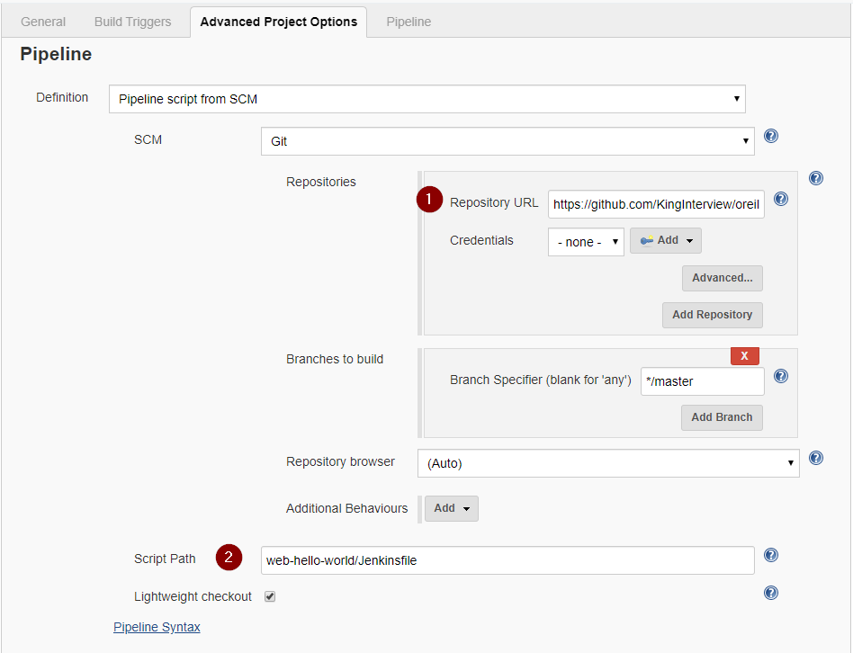
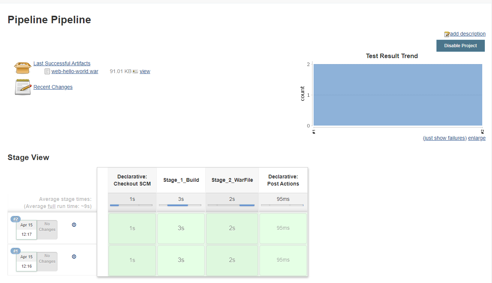

# Configuration as code & Pipelines
## Work done to this sample
I have added a Junit test to this sample code and added it to the gradle steps. I included a dummy test to prove that each test gets run individually. I have also used a Jenkinsfile to support configuration as code. This will create a 2 stage pipeline that will run a clean build and test of the code and then generate a war file that is added as a build artifact.

## Build tools - Added Gradle Wrapper with settings
* An older version of Gradle is needed to be able to use the 'Jetty'. Newer versions use 'Getty' This is controlled by the 'gradle-wrapper.properties' file

The Gradle Wrapper scripts are generated using the following command:
```
gradle wrapper
```

## Jenkins Pipeline
Jenkins can use the 'Jenkinsfile' to automatically create the build pipeline. This pipeline is compatible with Windows and Linux Jenkins agents.

Add a new Pipeline job:


Point to the repository that  contains the 'Jenkinsfile' (marked as '1' in the image).
Remap the location to the Jenkinsfile as it doesn't live on the root of the repo (marked as '2' in the image).



Once you have saved this configuration you will be able to run the build. Gradle will automatically be downloaded, and the stages will be displayed in the build job. Once you have run the build multiple times you will see the unit tests trend graph.



